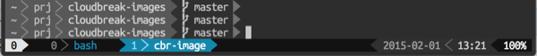

First let's see the one-liner
```
curl -Ls j.mp/powerline-doctor | bash
```

# My personal powerline config

I had a lots of trouble on my mac, when i upraded powerline. After a lot of
debugging i was able to have my settings back:


My preferred segments, for **shell**

- workdir (abreviated) 
- VCS branch, if any

for **tmux** reduced right side:

- date
- time
- battery percent
- no icons

## switch on/off powerline in shell

sometimes i want to use the whole width of the terminal and have a simple `$` as prompt.
here is a function to switch between powerline and short prompt:

```
pw() { 
    if [[ $ == $PS1 ]]; then
        . $(find $VIRTUAL_ENV -path \*bash/powerline.sh)
    else
        unset PROMPT_COMMAND;
        PS1=$;
    fi
}
```

## tl;dr

Make sure your profile has the language settings `LC_ALL` and `LANG`
```
export LC_ALL=en_US.UTF-8                                                                                       export LANG=en_US.UTF-8
export PIP_REQUIRE_VIRTUALENV=true
export PIP_DOWNLOAD_CACHE=$HOME/.pip/cache
export VIRTUAL_ENV="$HOME/.virtualenv"
export PATH="$PATH:~/apps/bin"
```

The biggest issue was, that powerline didn't work at all:

```
-bash: : command not found
```

it is a sympthom of powerline not beeing able to locate the `powerline`
binary. To check if your powerline can locate it:

```
$ powerline-config shell command

powerline
```

for me the problem was that the `VIRTUAL_ENV` env var wasn't absolute path,
So i fixed it in my `.profile`

``` diff
--- export VIRTUAL_ENV="~/.virtualenv"
++++ export VIRTUAL_ENV="$HOME/.virtualenv"
```

## troubleshooting tmux

Sometimes tmux just didn't seem to get config changes. So just close all tmux sessions,
and run `tmux kill-server`

